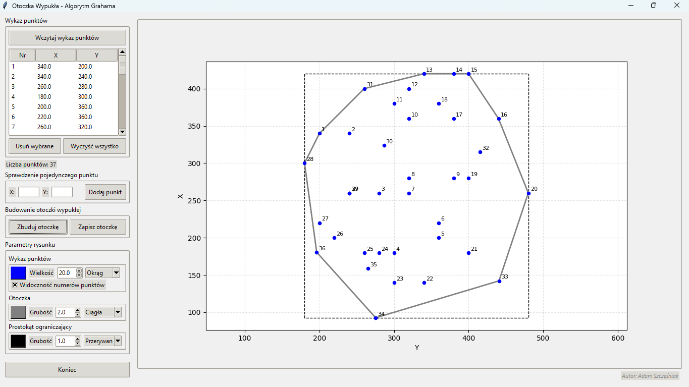

# Otoczka Wypukła (Convex Hull) - Algorytm Grahama

Aplikacja desktopowa napisana w języku Python z wykorzystaniem biblioteki **Tkinter** oraz **Matplotlib**, służąca do wyznaczania otoczki wypukłej zestawu punktów przy użyciu **Algorytmu Grahama**. Program został dostosowany do specyfiki układów geodezyjnych (oś X skierowana pionowo, oś Y poziomo).

 **

## 🚀 Funkcje programu
* **Wyznaczanie otoczki wypukłej** dla dowolnej liczby punktów ($n \ge 3$).
* **Automatyczne rysowanie prostokąta ograniczającego** (Bounding Box) dla analizowanego zbioru danych.
* **Geodezyjny układ współrzędnych** – odwzorowanie osi zgodne z polskimi standardami geodezyjnymi ($X$ pionowo, $Y$ poziomo).
* **Interaktywny panel graficzny**: Moduł umożliwiający zmianę kolorów, grubości linii, stylów (ciągła, przerywana) oraz symboli punktów na wykresie.
* **Zarządzanie danymi**: 
  * Wczytywanie punktów z plików tekstowych (`.txt`).
  * Ręczne dodawanie pojedynczych punktów z walidacją wprowadzanych danych.
  * Usuwanie wybranych punktów z tabeli lub czyszczenie całego zbioru.
  * Zapisywanie współrzędnych wyznaczonej otoczki do pliku tekstowego.

## 🛠️ Technologia
* **Język:** Python 3.x (aplikacja była testowana i rozwijana w wersji **Python 3.13**)
* **GUI:** Tkinter (stylizacja `ttk.Style` z motywem `clam`)
* **Wykresy:** Matplotlib (zintegrowany z Tkinter przez `FigureCanvasTkAgg`)

## 📦 Instalacja i uruchomienie

### Wersja deweloperska (Python)
1. Sklonuj repozytorium:
   ```bash
   git clone [https://github.com/Szczoopak/ConvexHull-GrahamScan.git](https://github.com/Szczoopak/ConvexHull-GrahamScan.git)
   cd ConvexHull-GrahamScan